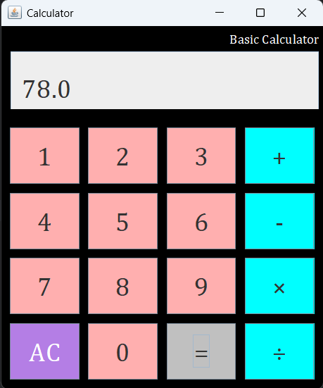

# Java GUI Calculator

## 📝 Summary

This is a basic **Calculator** built using **Java Swing GUI**. It supports simple arithmetic operations like addition, subtraction, multiplication, and division. The user interface is clean, colorful, and easy to use.

---

## ⭐ Features

- GUI-based calculator using Java Swing
- Supports `+`, `-`, `×`, and `÷` operations
- "AC" button to reset the input
- Shows error message when dividing by zero or on invalid input
- Responsive buttons with different colors for numbers and operators

---

## 🛠️ Technology Used

- **Java**
- **Java Swing** (`JFrame`, `JPanel`, `JButton`, `JLabel`, `JTextField`, etc.)
- Custom fonts and colors for styling the buttons

---

## 🖼️ Screenshot

---

## 👤 Author

**Md. Riad Hasan**  
BSCSE  
**Uttara University**

---

